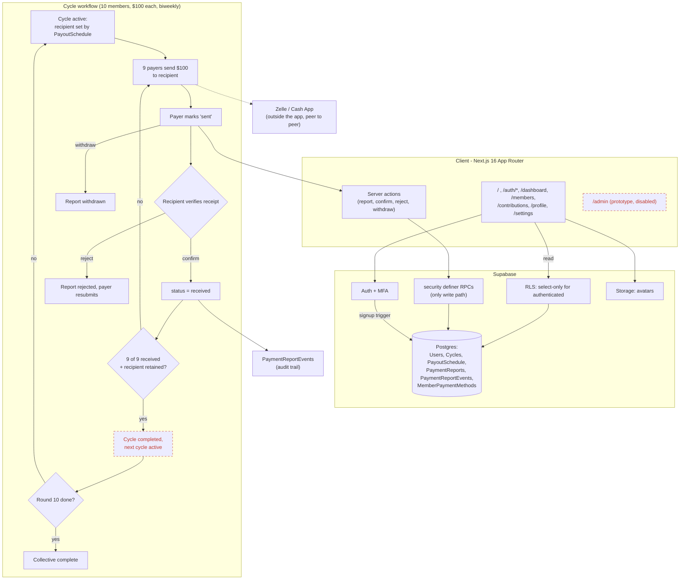

# BondFin Cycle Workflow

> Generated from `docs/bondfin - Cycle workflow.mmd` by `npm run diagrams`. Do not edit by hand.

```mermaid
flowchart TB
    subgraph Client["Client - Next.js 16 App Router"]
        Pages["/ , /auth/*, /dashboard, /members,<br/>/contributions, /profile, /settings"]
        Actions["Server actions<br/>(report, confirm, reject, withdraw)"]
        Admin["/admin (prototype, disabled)"]
    end

    subgraph Supabase["Supabase"]
        Auth["Auth + MFA"]
        RPC["security definer RPCs<br/>(only write path)"]
        RLS["RLS: select-only for authenticated"]
        DB[("Postgres:<br/>Users, Cycles, PayoutSchedule,<br/>PaymentReports, PaymentReportEvents,<br/>MemberPaymentMethods")]
        Storage["Storage: avatars"]
    end

    Ext["Zelle / Cash App<br/>(outside the app, peer to peer)"]

    Pages --> Auth
    Pages -->|read| RLS --> DB
    Actions --> RPC --> DB
    Auth -->|signup trigger| DB
    Pages --> Storage

    subgraph Flow["Cycle workflow (10 members, $100 each, biweekly)"]
        direction TB
        A["Cycle active:<br/>recipient set by PayoutSchedule"] --> B["9 payers send $100<br/>to recipient"]
        B --> C["Payer marks 'sent'"]
        C --> D{"Recipient verifies receipt"}
        D -->|confirm| E["status = received"]
        D -->|reject| F["Report rejected, payer resubmits"]
        C -->|withdraw| G["Report withdrawn"]
        E --> H{"9 of 9 received<br/>+ recipient retained?"}
        H -->|yes| I["Cycle completed,<br/>next cycle active"]
        H -->|no| B
        I --> J{"Round 10 done?"}
        J -->|no| A
        J -->|yes| K["Collective complete"]
    end

    B -.-> Ext
    C --> Actions
    E --> PaymentEvents["PaymentReportEvents<br/>(audit trail)"]

    classDef gap stroke-dasharray: 5 5,stroke:#c0392b,color:#c0392b
    class Admin,I gap
```
